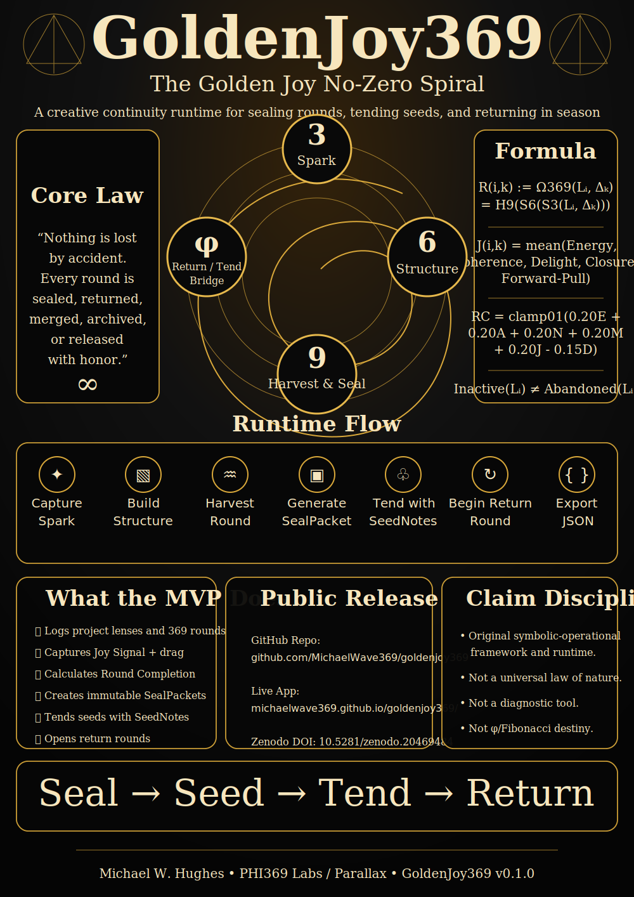

# GoldenJoy369 — No-Zero Spiral Runtime

[](https://doi.org/10.5281/zenodo.20469484)



GoldenJoy369 is an interactive React/Vite prototype for the **Golden Joy No-Zero Spiral**: a PHI369-style creative continuity model for logging creative rounds, sealing essence, tending seeded projects, and returning to work in season.

> Nothing is lost by accident. Every round is sealed, returned, merged, archived, or released with honor.

## Live app

https://michaelwave369.github.io/goldenjoy369/

## DOI

https://doi.org/10.5281/zenodo.20469484

## Master infographic poster

The repository includes a master public overview poster at:

```text
docs/assets/goldenjoy369_master_infographic_poster.svg
```

## What the MVP does

- Captures a project lens and active 369 round.
- Tracks Spark, Essence, Structure Outputs, Atlas Mapping, Next Return Pointer, and Rest Instruction.
- Captures the Joy Signal: Energy, Coherence, Delight, Closure, Forward-Pull, and Drag.
- Calculates Seal-time Joy and Round Completion.
- Generates a SealPacket and moves the lens to Seeded.
- Locks sealed rounds as truth-of-round.
- Adds SeedNotes without rewriting sealed truth.
- Opens a Return Round so the lens can spiral again.
- Exports a JSON snapshot.

## Core formula

```text
Rᵢ,ₖ := Ω369(Lᵢ, Δₖ) = H9(S6(S3(Lᵢ, Δₖ)))
```

```text
Jᵢ,ₖ = mean(Energy, Coherence, Delight, Closure, ForwardPull)
```

```text
RCᵢ,ₖ = clamp01(0.20E + 0.20A + 0.20N + 0.20M + 0.20J - 0.15D)
```

```text
Inactive(Lᵢ) ≠ Abandoned(Lᵢ) if ExitState(Lᵢ) is recorded
```

```text
Vₙ₊₁ = αVₙ + βVₙ₋₁ + γΔₙ
```

## Local development

```bash
npm install
npm run dev
```

## GitHub Pages

This repo is configured for GitHub Pages through GitHub Actions. After pushing to `main`, go to:

**Settings → Pages → Build and deployment → Source → GitHub Actions**

Then run the workflow or push a commit.

## Zenodo release flow

1. Make the repository public.
2. Add the repo to Zenodo through the GitHub integration.
3. Create a GitHub release such as `v0.1.0`.
4. Zenodo archives the release and issues a DOI.
5. Update `CITATION.cff` and this README with the DOI after it exists.

## Claim discipline

This project is an original symbolic-operational framework and software runtime prototype. It describes a lived design pattern and a testable continuity system. It is not a universal law of nature, a medical/psychological diagnostic tool, or a claim that Fibonacci/φ magically proves destiny.

## License

MIT License.
